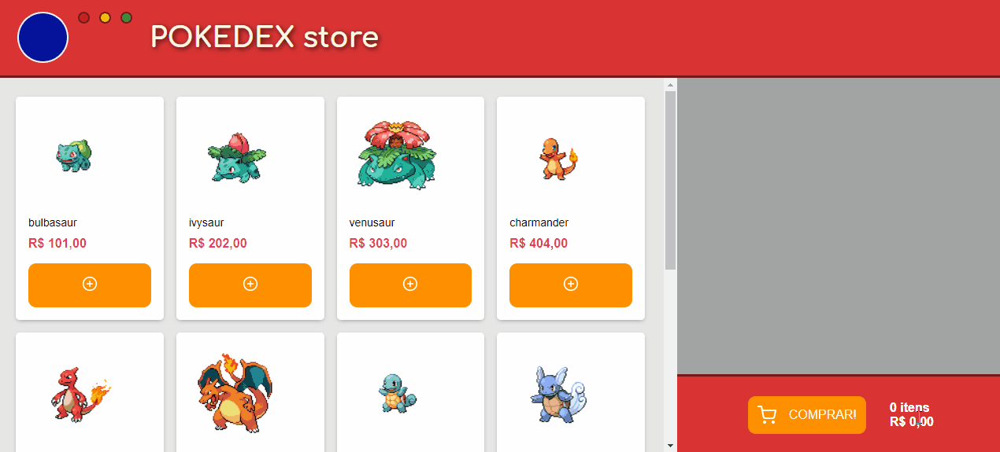

Check this app online: [Pokedex Store](https://pokedexstore.netlify.app/)

## 🛒 POKEDEX STORE

Pokedex store is a e-commerce that sells a huge variety of pokemons. this project focus on learning to react using the public pokemon pokemon API [pokeapi](https://pokeapi.co/api/v2/).

### 💻 Technologies
This project was developed in React-native and typescript.

**Libraries and packages:** 
**axios:** Making external calls to APIs. 
**polished:** Used to cause changes in styles in response to user interactions. 
**react-icons:** Icon pack for react. 
**react-router-dom:** Routing in react. 
**react-spring:** Animation library. 
**styled-components:** Styling library. 
**yup:** Library for data validation. 

### ⚖ LICENSE

The project can be copied and modified, as long as due credit is given.
